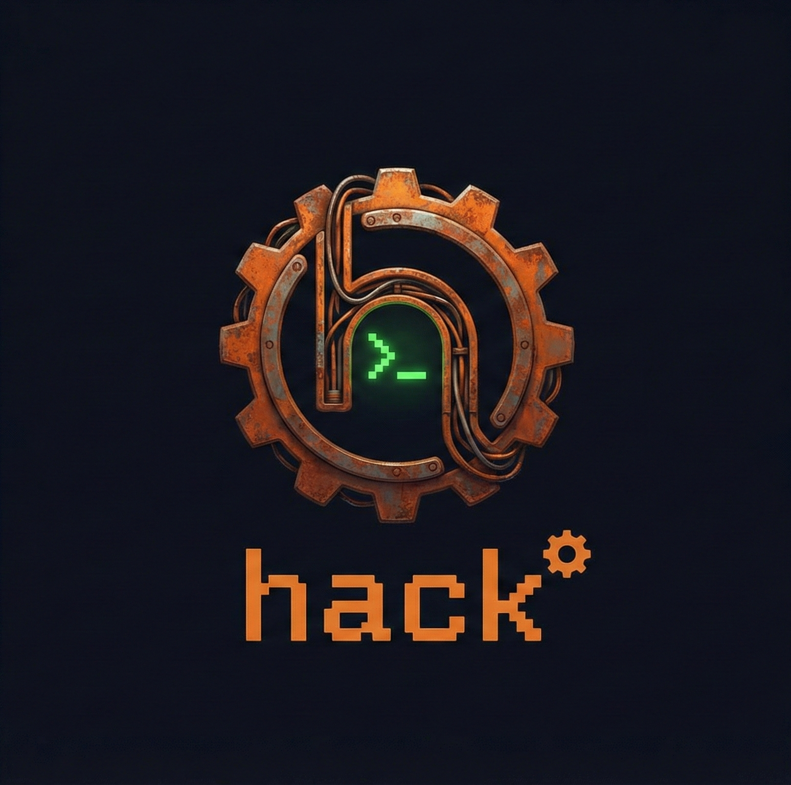

</a>

<!--  -->
<!--  -->
<!--  -->
<!--  -->

### A CLI tool to quickly interact with stuff I do not enjoy interacting with.

[Develop](#develop) |
[Ideas](#ideas)

`hack` is a personal tool I use to enable automation on the CLI. It is not a tool to aggregate
snippets (I use `sofa` for this), but a tool to implement slightly more complex workflows that I
find useful.

## Purpose

The idea behind `hack` is to automate everything that is a pain in my daily life that I want to
either avoid doing repetitively, or that costs time to do manually. At the same time, it should be
generic enough to be re-usable. It therefore follows the following principles:

- **Simple**: it is meant to be very simple to extend and change. Thus why I chose Lua rather than
  Rust for the implementation. I want to iterate very quickly. However, it does not try to be
  feature complete in regards to any functionality, implementing only the bare minimum that is
  required.
- **Generic**: the tool should be programmed in a way that is generic enough to be portable between
  environments. It should not rely on very specific aspects of the external environment, other than
  my own Nix setup. This way it is re-usable across projects that I work on.
- **Composable**: `hack` should follow the Unix philosophy that its output is composable with other
  tools, or that it can accept output from other tools as input.
- **Self-documenting**: the tool should be self-documenting via its command line help pages and
  internal code. No separate documentation will be maintained.

## Develop

## Ideas

- Bitbucket build flags
- Keycloak operations

## Notes
